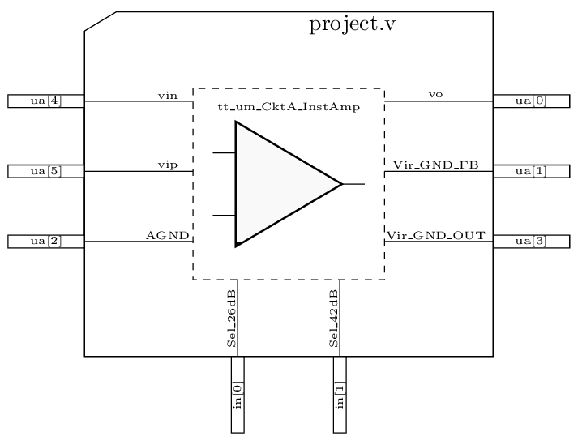

 

# Instrumentation Amplifier for Electrocardiogram Signal Adquisition
- [Read the documentation for project](docs/info.md)

## How it works
An Instrumentation Amplifier (IA) is a circuit that can extract low-level low-frequency differential signals that are embedded in high-level common noise signals. This IA’s ability is due to the value of the Common Mode Rejection Ratio (CMRR) is very high; the CMRR must be grater than 120 dB.  So that, IAs are widely used in biomedical applications, specifically as an analog front-end for electrocardiogram (ECG) data acquisition.

Figure 1 shows how the designed IA must be connected as a 3 leads configuration to a human patient to obtain the unfiltered version of the ECG.

  

  <em>Figure 1: ECG 3 lead configuration.</em>

## How to test
Figure 2 shows the top-level bock diagram of the IA with all the inputs an outputs that can be accessed as well as all the hardware thar is needed to perform the CMRR measurements. The purpose of each pin is described as follows:

- **ua[0].** This pin is the output of the IA. It must be connected to the Reception (Rx) port of the ENA vector analyzer.
- **ua[1,3].** An Rf resistor must be connected between these terminals.
- **ua[3].** This terminal must be connected to an analog ground of 0.9 V.
- **ua[2].** Analog ground of 0.9 V.
- **ua[4,5].** These two terminals are the IA’s input. A differential signal must be applied to them. To this end, a balun must be places before to convert the Tx single-mode signal coming from the ENA to a differential version.
- **in[0,1].** This digital pin is a bit control for gain selection. For in[0]=0 and in[1]=0, de differential gain is 10 dB. For in[0]=1 and in[1]=0, de differential gain is 26 dB. For in[0]=1 and in[1]=1, de differential gain is 42 dB. To this end, a pull-up network must be attached to them.

After assembling the setup in Figure 1, the ENA must be configured to report the magnitude (in dB) and phase of the circuit. Also, the magnitude must be reported for differential-mode gain and common-mode gain. After that, these two magnitudes must subtracted one from the other to obtain the CMMR.

  

  <em>Figure 2: IA's testbench.</em>

Figure 3 shows the interconnection of the circuit with the frame of the chip and Figure 4 shows the simulation results for reference to the behavior of the circuit.

  

  <em>Figure 3: Frame to IA connections</em>

  

  <em>Figure 4. Simulation results.</em>

